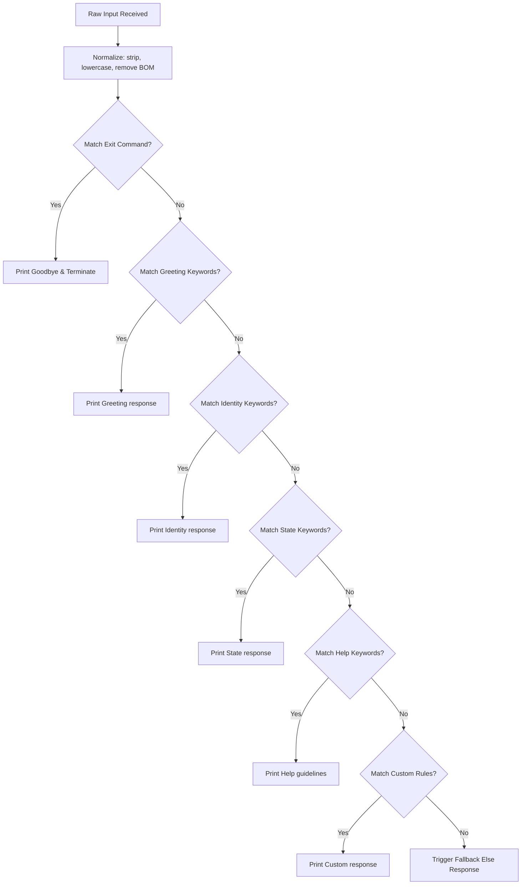

# RoboRule - Rule-Based AI Chatbot 🤖

RoboRule is an educational, interactive implementation of a **Rule-Based AI Chatbot** (Project 1). It satisfies core control-flow requirements (continuous loop, if-else logic, and normalization) via a command-line script while providing a high-fidelity visual web simulator dashboard to inspect the matching logic in real time.

---

## 🌟 Key Features

*   **Standalone Python CLI Chatbot**: A clean, robust `chatbot.py` script running a standard interactive console loop.
*   **Live Decision Tree Visualizer**: A graphical flowchart inside the browser that animates and highlights the exact evaluation path (`if-elif-else`) taken by the rule engine.
*   **Dynamic Rule Manager**: Add custom trigger keywords and responses dynamically in the GUI to see how the bot's behavior changes.
*   **Real-time Python Code Compiler**: An integrated code pane displaying the Python equivalent of the rule engine, updating instantly as new rules are added.
*   **Interactive CLI Terminal Simulator**: A mock shell window embedded in the dashboard reflecting console interactions.

---

## 📁 Repository Structure

```
├── chatbot.py        # Standalone Python CLI Chatbot script
├── index.html        # Main HTML layout for the Interactive Simulator
├── styles.css        # Premium glassmorphic styling sheets & animations
├── app.js            # Frontend logic, rule evaluator, and path animator
└── README.md         # Project documentation (this file)
```

---

## 🚀 Running the Project

### 1. Command-Line Chatbot (Python)
You can run the chatbot directly inside your terminal using Python:

```bash
python chatbot.py
```

*   **Trigger Commands**: Try typing `hello`, `who are you`, `how are you`, or `help`.
*   **Exit Commands**: Type `exit`, `quit`, `bye`, or `goodbye` to terminate the program.

### 2. Interactive Web Simulator
No installation or compiler is required. Simply open the web page:
*   Double-click `index.html` in your file explorer to open it in a web browser.
*   *Alternatively*, start a local server using python:
    ```bash
    python -m http.server 8000
    ```
    Then visit `http://localhost:8000` in your web browser.

---

## ⚙️ How the Rule Engine Works (Logic flow)



---

## 🎓 Learning Objectives
This project demonstrates several foundational concepts:
1.  **Control Flow**: Sequential evaluations using `if`, `elif`, and `else` blocks.
2.  **Input Normalization**: Cleaning input strings (removing formatting spaces, casing, and byte-order-marks) to prevent matching failures.
3.  **Continuous Loops**: Executing code blocks repeatedly until state variables or commands trigger an exit.
4.  **AI Rule-Based Decision Logic**: The precursor to modern NLP models, operating on deterministic keyword lookup tables.
